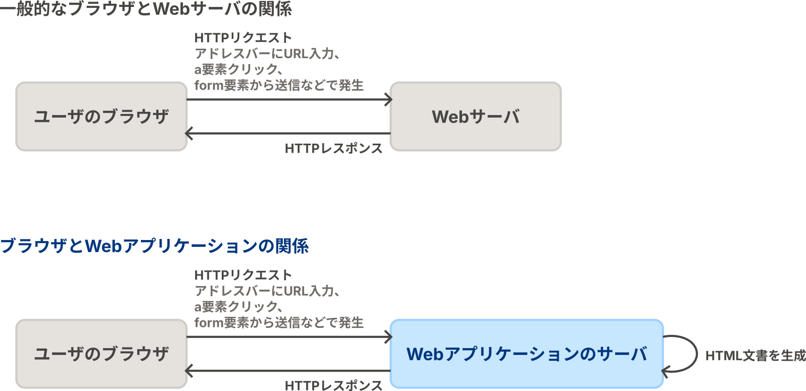

# HTTPとWebアプリケーションの話

WebアプリケーションはHTTP（HyperText Transfer Protocol）を応用した技術で、Web上のサーバでアプリケーションを実行して、ブラウザおよびHTTPを通して利用させることで、ユーザにアプリケーションの機能を提供します。

## 📌 HTTP

HTTPは元々WWW（World Wide Web）を実装するために開発された技術、つまり「ユーザがブラウザというアプリを用いて、離れた場所のサーバに配置してある文書を取得・閲覧する」という機能を実現するために開発された技術です。
ユーザがサーバ上の文書を閲覧するために、ブラウザのアドレスバーにURLを入力したりHTML文書の`a`要素をクリックしたりすると、ブラウザはHTTPリクエストをWebサーバに送信します。
WebサーバはHTTPリクエストの内容に応じて、HTTPレスポンスを返します。
HTTPレスポンスの中身はHTML文書であることが多いです。

## 📌 Webアプリケーション

Webアプリケーションは、サーバがHTTPリクエストの内容に応じたプログラムを実行・HTML文書を生成して返すことで、アプリケーションのような動きの実現を試みるものです。
純粋に文書を提供するだけのWebサーバの場合、人が手を加えない限りWebサーバが返すHTML文書の内容が変わることはありません。
しかし、Webアプリケーションの場合、アプリケーションの内部状態に応じてHTML文書を生成して返しています。
そのため、ブラウザにとってはただHTTPでサーバとやり取りを行なっているだけですが、ユーザにとっては、`a`要素や`form`要素で作られたUIを操作すると、自分の操作に応じて画面が変化する（表示されるHTML文書が変わる）のでアプリケーションのように見える、という仕組みです。

## 📌 HTTPリクエスト

HTTPリクエストは、ユーザにとってはWebアプリケーションのサーバに実行してほしいプログラムを指定する情報が含まれているものであり、Webアプリケーションのサーバにとっては自身が実行するプログラムを選択する手がかりとなる情報が含まれているものです。
具体的には次のような情報が含まれています。

- **メソッド**：リクエストの目的（アプリケーションの情報を取得するためのリクエストか、アプリケーションに情報を登録するためのリクエストか、など）を区別する。
- **URL**：呼び出す機能を指定する。
    - URLは次のような文字列である。  
      `https://example.com/path/to/program?param0=value0&param1=value1`
    - **パス**：`/path/to/program`の部分。
    - **クエリパラメータ**：`?param0=value0&param1=value1`の部分。この例の場合、名前が`param0`で値が`value0`のパラメータと、名前が`param1`で値が`value1`のパラメータから成る。
- **HTTPヘッダ**：リクエストそのものについての情報（HTTPボディの形式がどうであるか、など）を持つ。
- **HTTPボディ**：アプリケーションに伝える情報を持つ。リクエストによってはHTTPボディを持たないことがある。
    - HTTPボディに用いられるデータの形式は様々であるが、今回は`application/x-www-form-urlencoded`という、クエリパラメータと同じ形式を用いる。

## 📌 ブラウザからHTTPリクエストを送信する方法

ブラウザからWebアプリケーションにHTTPリクエストを送信する方法は複数あります。

- アドレスバーにURLを入力する。GETメソッドのリクエストのみを送信できる。
- HTML文書の`a`要素（いわゆるハイパーリンク）をクリックする。GETメソッドのリクエストのみを送信できる。
- HTML文書の`form`要素（いわゆるフォーム）に情報を入力して送信ボタンをクリックする。GETメソッドとPOSTメソッドのリクエストを送信できる。

## 👉 HelloServletの例

サンプルコードでは、Webアプリケーションの裏側で何が起こっているのかを簡単にご理解いただくために、[HelloServlet.java](../../src/main/java/servlet/hello/HelloServlet.java)というファイルを用意しました。
[サンプルコードのアプリケーションを起動](../../README.md#️-開発したアプリケーションを起動する)して、ブラウザで http://localhost:8080/systemdesign2024/hello-servlet にアクセスしてください。
すると、

1. ブラウザは上記のURLにHTTPリクエストを送信します。
2. HTTPリクエストを受け取ったWebアプリケーションのサーバは、そのURLに紐付けられている `HelloServlet.doGet`メソッドの内容を呼び出します。
3. `HelloServlet.doGet`メソッドには、HTTPレスポンスとしてHTML文書を返すプログラムが書いてありますので、Webアプリケーションのサーバがレスポンスを返し終わったら、ブラウザの画面にはそのHTML文書の内容が表示されるはずです。

このプログラムの内容を、アプリケーションの状態に応じてHTML文書の内容が変化するように書き替えれば、アプリケーションのような挙動を実現できます。
しかし、今回の授業の課題で求められているような複雑なアプリケーションの挙動を1つのファイルのプログラムだけで実現するのは難しいです。
ただHTTPリクエストの内容によってHTML文書の内容が変わるだけならいいかもしれませんが、アプリケーションの情報をデータベースに持たせるとか、データベースへの読み書きを行う必要があるとか、そうなるとどうでしょうか……。

そこで、stuinfoでは、複雑なアプリケーションを整理して捉えるためのアーキテクチャを導入しています。

## 📌 GETメソッドとPOSTメソッドの使い分けと処理方法

`form`要素からはGETメソッドのリクエストとPOSTメソッドのリクエストの2種類を送信することができますが、`form`要素を書く際にどちらを選べば良いのかとか、各メソッドのリクエストをどのように処理すれば良いのかについて、毎年多くの受講生が頭を悩ませています。
そこで、メソッドの使い分けやそれを踏まえたリクエストの処理方法について記しておきます。

- GETメソッドのリクエスト
    - アプリケーションから情報を取得するだけのユースケースで用いられる。
    - リクエストに対するレスポンスではHTML文書をそのまま返すことが多い。
    - プレゼンテーション層の実装にサーブレットやJSPを用いている場合、HTML文書を返すために、モデルの情報をHTML文書に変換するのに使用するJSPを指定する。このためのプログラムの記述を「**フォワード**」と呼ぶ。
- POSTメソッドのリクエスト
    - アプリケーション上の情報の書き換えを伴うユースケースで用いられる。
    - リクエストに対するレスポンスでは、指定のURLにアクセスするようにブラウザに指示する「**リダイレクト**」を返して、別のURLにGETメソッドを送信させることが望ましい。
        - POSTリクエストに対するレスポンスでHTML文書をそのまま返した場合、ブラウザが再読み込みを行う度にPOSTリクエストが繰り返され、ユーザが意図しないうちにアプリケーション上の情報を書き換える可能性がある。
        - POSTリクエストを処理するプログラムは、アプリケーション上の情報の書き換えを行ったらリダイレクトを返して、処理結果の表示はGETメソッドを処理する別のプログラムに任せるように設計することが多い。

今回はstuinfoのサンプルコードとは別に、これを説明するためだけのサンプルコードを用意しました。

- [HelloGet.java](../../src/main/java/servlet/hello/HelloGet.java)：`<コンテキストパス>/hello-get`に対するGETリクエストを処理するサーブレット。`hello-jsp.jsp`がHTML文書を生成して返すように指定する（**フォワード**）。
- [HelloPost.java](../../src/main/java/servlet/hello/HelloPost.java)：`<コンテキストパス>/hello-post`に対するPOSTリクエストを処理するサーブレット。`<コンテキストパス>/hello-get`にアクセスさせるために**リダイレクト**を返す。
- [HelloPost2.java](../../src/main/java/servlet/hello/HelloPost2.java)：`<コンテキストパス>/hello-post2`に対するPOSTリクエストを処理するサーブレット。`<コンテキストパス>/hello-get`にアクセスさせるために**リダイレクト**を返す。
- [hello.jsp](../../src/main/webapp/WEB-INF/hello/hello.jsp)：JSP。リクエストに含まれるパラメータを表示する。

[サンプルコードのアプリケーションを起動](../../README.md#️-開発したアプリケーションを起動する)して、ブラウザでまずは http://localhost:8080/systemdesign2024/hello-get にアクセスしてください。
すると、

1. ブラウザは上記のURLにGETリクエストを送信します。
2. リクエストを受け取ったWebアプリケーションのサーバは、上記URLに対するGETメソッドに対応する`HelloGet.doGet`メソッドを呼び出します。
3. `HelloGet.doGet`メソッドは、レスポンスのHTML文書を`hello.jsp`に生成させるために「フォワード」を行います。
4. `hello.jsp`はHTML文書を生成してレスポンスを返します。
5. ブラウザには`hello.jsp`によって生成されたHTML文書が表示されます。

HTML文書が表示されている画面を操作してみましょう。

- `a`要素によって作られたリンクが3種類あります。それぞれクリックしてみましょう。
    - `<コンテキストパス>/hello-get にアクセスする`
       - 先ほどブラウザのアドレスバーに入力したのと同じURLにアクセスして、同じHTML文書を得たことになるので、画面に変化はみられません。
    - `<コンテキストパス>/hello-post にアクセスする`
        1. ブラウザは、`<コンテキストパス>/hello-post`にGETリクエストを送信します。
        2. Webアプリケーションのサーバは、`HelloPost.doGet`メソッドを呼び出そうとしますが、それは実装されていないため、Webアプリケーションのサーバはエラーを返します。
    - `<コンテキストパス>/hello-get?parameterInGetRequest=You_clicked_the_hyperlink にアクセスする`
        1. ブラウザは、`<コンテキストパス>/hello-post`にGETリクエストを送信します。リクエストの`parameterInGetRequest`パラメータには、`You_clicked_the_hyperlink`という文字列が指定されています。
        2. Webアプリケーションのサーバは、このURLに紐付けられた`HelloGet.doGet`メソッドを呼び出します。
        3. `HelloGet.doGet`メソッドは、レスポンスのHTML文書を`hello.jsp`に生成させるために「フォワード」を行います。
        4. `hello.jsp`は、リクエストに含まれる`parameterInGetRequest`パラメータの値を書き込んだHTML文書を生成して返します。したがって、そこに`You_clicked_the_hyperlink`と書かれたHTML文書が返ってきます。
- `form`要素によって作られたリンクが3種類あります。それぞれ操作して送信してみましょう。
    - `<コンテキストパス>/hello-get にGETリクエストを送信するためのフォーム`
        1. ブラウザは、`<コンテキストパス>/hello-get`にGETリクエストを送信します。リクエストの`parameterInGetRequest`パラメータには、入力した文字列が指定されています。
        2. Webアプリケーションのサーバは、このURLに紐付けられた`HelloGet.doGet`メソッドを呼び出します。
        3. `HelloGet.doGet`メソッドはレスポンスのHTML文書を`hello.jsp`に生成させるために「フォワード」を行います。
        4. `hello.jsp`は、リクエストに含まれる`parameterInGetRequest`パラメータの値を書き込んだHTML文書を生成して返します。したがって、そこに入力した文字列が書かれたHTML文書が返ってきます。
    - `<コンテキストパス>/hello-post にPOSTリクエストを送信するためのフォーム`
        1. ブラウザは、`<コンテキストパス>/hello-post`にPOSTリクエストを送信します。リクエストの`parameterInPostRequest`パラメータには、入力した文字列が指定されています。
        2. Webアプリケーションのサーバは、このURLに紐付けられた`HelloPost.doPost`メソッドを呼び出します。
        3. `HelloPost.doPost`メソッドは、`<コンテキストパス>/hello-get`にアクセスさせるようにリダイレクトを返します。
        4. ブラウザは、返ってきたリダイレクトを踏まえて`<コンテキストパス>/hello-get`にGETリクエストを送信します。
        5. Webアプリケーションのサーバは、このURLに紐付けられた`HelloGet.doGet`メソッドを呼び出します。
        6. `HelloGet.doGet`メソッドは、レスポンスのHTML文書を`hello.jsp`に生成させるために「フォワード」を行います。
        7. `hello.jsp`はHTML文書を生成します。**生成したHTML文書には`parameterInPostRequest`パラメータの値は書き込まれていませんでした**。
            - `parameterInPostRequest`パラメータは、1で送信したPOSTリクエストには含まれていましたが、4で送信したGETリクエストには含まれていません。ブラウザは4のときに、どのパラメータにも値が含まれていないリクエストを送信したことになります。
            - **📌 `doPost`メソッドでリダイレクトする場合で、`doPost`メソッドからリダイレクト先のHTML文書の内容を書き換えたい場合は、**
                - `doPost`メソッドは、アプリケーションの状態によってリダイレクト先のURLのクエリパラメータを変えるように実装する必要があります。
                - リダイレクト先に紐付けられているサーブレットおよびJSPは、クエリパラメータの値によって生成されるHTML文書の内容を変えるように実装する必要があります。
    - `<コンテキストパス>/hello-post2 にPOSTリクエストを送信するためのフォーム`
        1. ブラウザは、`<コンテキストパス>/hello-post2`にPOSTリクエストを送信します。リクエストの`parameterInPostRequest`パラメータの値に入力した文字列が指定されています。
        2. Webアプリケーションのサーバは、このURLに紐付けられた`HelloPost2.doPost`メソッドを呼び出します。
        3. `HelloPost2.doPost`メソッドは、`<コンテキストパス>/hello-get`にアクセスさせるようにリダイレクトを返します。**このとき、`parameterInGetRequest`パラメータに、`parameterInPostRequest`パラメータの値を指定するようにしています**。
            - `HelloPost.doPost`メソッドは、ただ`<コンテキストパス>/hello-get`にアクセスさせるようにリダイレクトを返すだけでした。
            - しかし、`HelloPost2.doPost`メソッドは、リクエストの`parameterInPostRequest`パラメータの値によってリダイレクト先のURLのクエリパラメータの値を変えることで、4で送信するリクエストにパラメータが含まれるようにしています。
        4. ブラウザは、返ってきたリダイレクトを踏まえて`<コンテキストパス>/hello-get`にGETリクエストを送信します。**リクエストの`parameterInGetRequest`パラメータには、1で入力した文字列が指定されています**。
        5. Webアプリケーションのサーバは、このURLに紐付けられた`HelloGet.doGet`メソッドを呼び出します。
        6. `HelloGet.doGet`メソッドは、レスポンスのHTML文書を`hello.jsp`に生成させるために「フォワード」を行います。
        7. `hello.jsp`はHTML文書を生成します。**生成したHTML文書には`parameterInPostRequest`パラメータの値は書き込まれていませんが、`parameterInGetRequest`パラメータの値として1で入力した値が書き込まれていました**。
