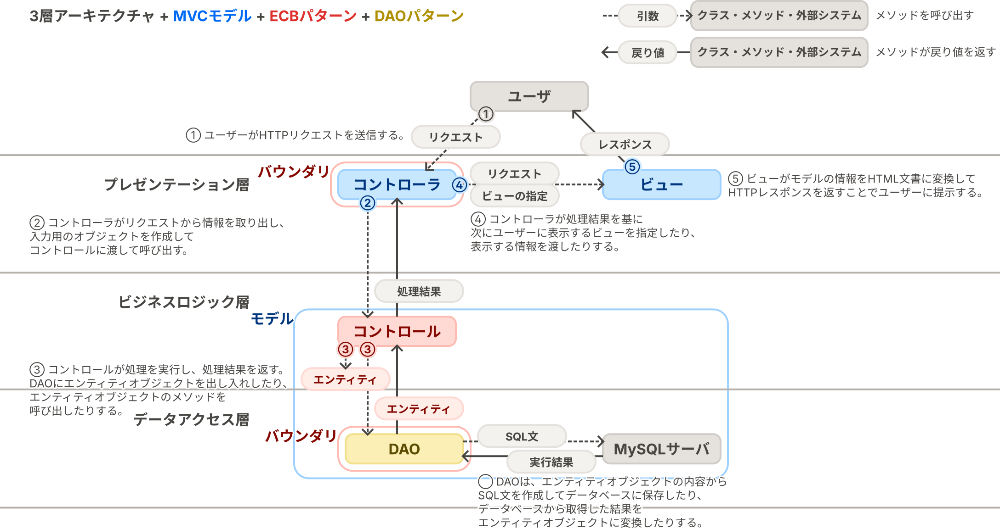
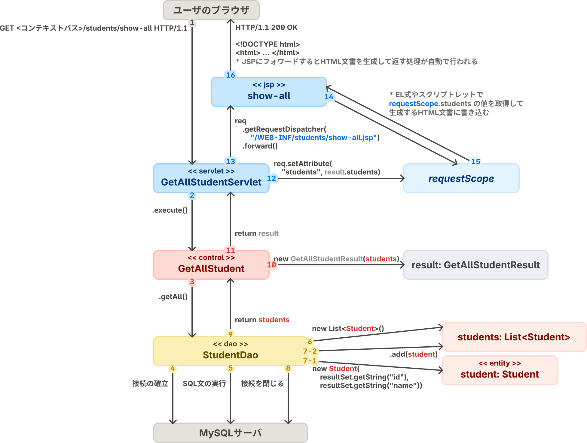
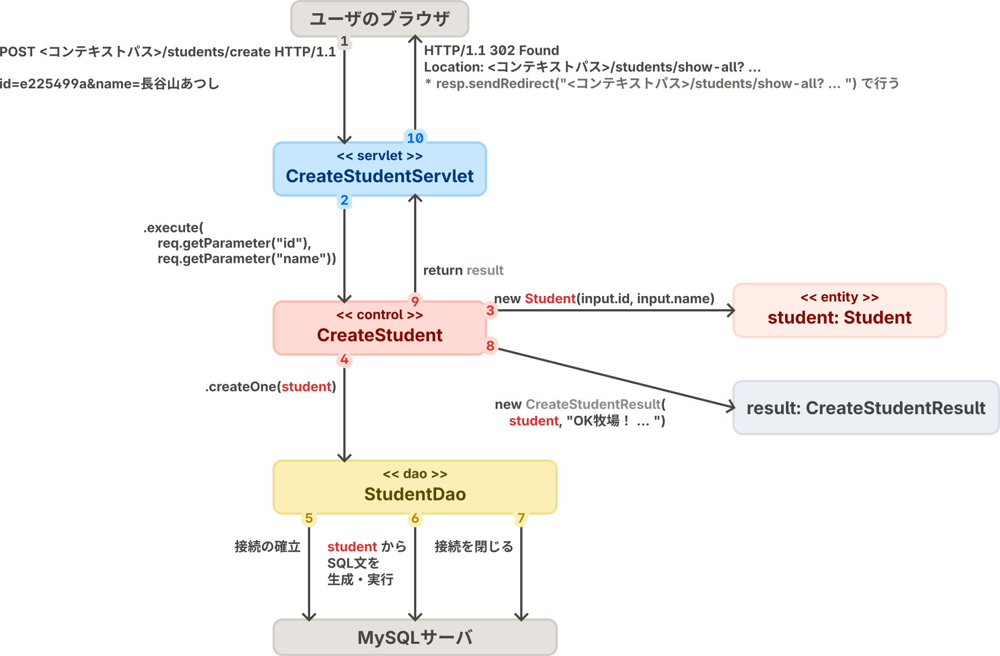

# stuinfo: 学生の情報を登録・取得する機能を持つアプリケーションのサンプル

このテンプレートリポジトリに何も手を付けていない状態であれば、このリポジトリには、学生の情報を登録・取得する機能を持つアプリケーション（stuinfo）のサンプルコードが含まれています。

## 🧭 アプリケーションの概要

stuinfoは、学生の情報の登録、全件取得、1件取得の3つのユースケースを実装した簡単なWebアプリケーションです。

実装にはプログラム言語Javaを用い、Java Platform, Standard Editionの拡張機能・Jakarta EEで定められている仕様である「[Jakarta Servlet](https://jakartaee.github.io/servlet/)」および「[Jakarta Server Pages (JSP)](https://jakarta.ee/ja/specifications/pages/3.0/)」に沿って実装しています。

## 📂 ディレクトリ構成の説明

- `src`
    - `main`
        - `java`：Javaのソースコードを配置するディレクトリです。
        - `resources`：開発するアプリケーションで使用するデータや設定ファイルを配置するディレクトリです。
        - `webapp`：サーブレットコンテナから配信するファイルやJSPを配置するディレクトリです。内部の`WEB-INF`ディレクトリにファイルを配置すると、そのファイルはアプリケーションのユーザからは見えなくなります。セキュリティ上の理由から、JSPファイルは`WEB-INF`ディレクトリに配置することが望ましいとされています。

## 📌 サンプルコードのアーキテクチャ

サンプルコードでは、全体を通して、プレゼンテーション層、ビジネスロジック層、データアクセス層の3層からなる**3層アーキテクチャ**を導入しています。
このアーキテクチャはWebアプリケーションの開発で一般的に用いられているものです。

- **プレゼンテーション層**：ユーザとWebアプリケーションの境界であり、ユーザからの入力をビジネスロジック層に渡す前の前処理を行ったり、ビジネスロジック層での処理結果を視覚化してユーザに表示したりする。
- **ビジネスロジック層**：Webアプリケーションで扱う概念やそれらに対する処理をプログラム言語で表現する。
- **データアクセス層**：Webアプリケーションで扱うデータをデータベースに読み書きする。

3層アーキテクチャは、Webアプリケーションが大まかに上記の3層から構成されるものとみなしますが、各層の詳細なアーキテクチャは実装者の判断に委ねられています。

そこで、サンプルコードでは、プレゼンテーション層を整理するために、**MVCモデル**を導入しています。
MVCモデルは、GUIアプリケーションが、アプリケーションで扱う概念やそれらに対する処理を表現する **モデル（Model）** 、モデルの内容を画面に表示する仕組みである **ビュー（View）** 、ユーザの操作を処理してモデルを書き換えたり表示するビューを差し替えたりする仕組みである **コントローラ（Controller）** から構成されるとする考え方です。（ECBパターンのコントロールとMVCモデルのコントローラは全く別物なので注意してください）

ビジネスロジック層では、OOSE（オブジェクト指向ソフトウェア工学・後のラショナル統一プロセス）発祥の**ECBパターン**を導入しています。
ECBパターンでは、Webアプリケーションで扱う概念である **エンティティ（Entity）** と、それを操作する **コントロール（Control）** を実装します。
また、ユーザからコントロールを呼び出せるようにするための仕組みや、エンティティオブジェクトをデータベースに読み書きするための仕組みなど、ビジネスロジック層の内外をつなぐ仕組みとして **バウンダリ（Boundary）** を実装します。

データアクセス層では、J2EE（現在のJakarta EE）発祥のデザインパターンである**DAO（Data Access Object）パターン**を導入しています。
DAOパターンは、データベースを、ドメインオブジェクト（ECBパターンのエンティティにあたる）の読み書きを行える**DAO**と呼ばれるクラスに抽象化するもので、ドメインオブジェクトのデータベースへの読み書きを伴う処理は、SQL等を意識することなくDAO経由で行えるようになります。

上記の内容を一つの図にまとめると次のようになります。

## ユースケースおよびステレオタイプごとのソースファイル一覧

サンプルコードでは、上記のアーキテクチャに基づいてプログラムを複数のファイルに分割しています。
次の表では、ユースケースごと・ステレオタイプ（コントロール、エンティティといったクラスの種類）ごとに、そのユースケースに関係するクラスをどのソースファイルに記述しているのかをまとめています。

|ユースケース|ビュー（JSP）|コントローラ（サーブレット）|コントロール|操作するエンティティ|DAO|
|--|--|--|--|--|--|
|**すべての学生の情報の取得**|[show-all.jsp](./main/webapp/WEB-INF/students/show-all.jsp)|[ShowAllStudentServlet.java](./main/java/servlet/students/ShowAllStudentServlet.java)|[GetAllStudent.java](./main/java/control/students/GetAllStudent.java)|[Student.java](./main/java/entity/Student.java)|[StudentDao.java](./main/java/dao/StudentDao.java)|
|**指定した学籍番号の学生の情報の1件取得**|[show-one.jsp](./main/webapp/WEB-INF/students/show-one.jsp)|[ShowOneStudentServlet.java](./main/java/servlet/students/ShowOneStudentServlet.java)|[GetOneStudent.java](./main/java/control/students/GetOneStudent.java)|[Student.java](./main/java/entity/Student.java)|[StudentDao.java](./main/java/dao/StudentDao.java)|
|**学生の情報の登録**|なし（「すべての学生の情報の取得」に対応する画面を表示）|[CreateStudentServlet.java](./main/java/servlet/students/CreateStudentServlet.java)|[CreateStudent.java](./main/java/control/students/CreateStudent.java)|[Student.java](./main/java/entity/Student.java)|[StudentDao.java](./main/java/dao/StudentDao.java)|

## コミュニケーション図

[サンプルコードのアーキテクチャの説明](#-サンプルコードのアーキテクチャ)で示した図をより具体化してコミュニケーション図として表現したものをユースケースごとに作成しました。

### 「すべての学生の情報の取得」ユースケース  

### 「学生の情報の登録」ユースケース  

## プレゼンテーション層の実装（サーブレット、JSP）

サンプルコードでは、HTTPやHTMLの仕組みを利用して、プレゼンテーション層を次のように実装しています。

- ビュー
    - モデルの情報をHTML文書に変換するプログラムとして実装する。
    - JSPとして実装する。
    - 変換後のHTML文書には、MVCモデルのコントローラにHTTPリクエストを送信するための`a`要素や`form`要素が含まれているようにする。
- コントローラ
    - HTTPリクエストを受け取った時に、リクエストのURLに対応したユースケースのプログラムが呼び出されるように実装する。
    - 処理結果に応じて、モデルの情報をビューに渡したり、モデルの情報をHTML文書に変換するのに用いるJSPを指定したりする。
    - `jakarta.servlet.HttpServlet`のサブクラス（単に「サーブレット」と呼ばれる）として実装する。

これらをビルドしたものをサーブレットコンテナ（サーブレットの仕様に沿って開発されたアプリケーションを実行するための仕組み）に読み込ませて実行すると、Webアプリケーションとして利用させることができます。

### 📌 モデルの情報をビューに渡す方法

ビューはモデルの情報をHTML文書に変換しますが、ビューはモデルの情報をどのように取得するのでしょうか？

サーブレットおよびJSPの仕様に従って実装する場合、サーブレット（MVCモデルの「コントローラ」）は、コントロール（ECBパターンの「コントロール」）からモデルの情報を取得し、**「requestオブジェクト」**（サーブレットのメソッドの第1引数のオブジェクトで、`HttpServletRequest`型のオブジェクト）を経由してJSP（ビュー）に渡します。
requestオブジェクトにモデルのオブジェクトを割り当て、requestオブジェクトをJSPに渡して、JSPでrequestオブジェクトからモデルのオブジェクトを取得することで、モデルの情報をビューに渡すことができます。
具体的には次の手順で行います。

1. コントロールが処理結果としてモデルの情報を返すようにすることで、サーブレットがモデルの情報を取得できるようにします。
2. サーブレットは、requestオブジェクトの`setAttribute`メソッドに処理結果として取得したモデルのオブジェクトを渡すことで、requestオブジェクトにモデルのオブジェクトを割り当てます。
    - `setAttribute`メソッドを呼び出す際には、「キー」とそのキーに対応するオブジェクトを渡します。キーを変えることで複数のオブジェクトをrequestオブジェクトに割り当てることができます。
3. サーブレットは、HTML文書をJSPに生成させるためにフォワードします。フォワードする際に、requestオブジェクトがJSPに渡されます。
4. JSPでは、EL式やスクリプトレットを用いることで、サーブレットから渡されたrequestオブジェクトからモデルのオブジェクトを取得することができます。
    - EL式を用いる場合は`requestScope.<キー>`という式で、そのキーに対応するオブジェクトを取得することができます。

## ビジネスロジック層の実装

サンプルコードでは、コントロールおよびエンティティを次のように実装しています。

- コントロール
    - 入力用のオブジェクト（`*Input`型のオブジェクト）を受け取り、出力用のオブジェクト（`*Result`型のオブジェクト）を返すように実装する。
    - アプリケーションに新しい情報を登録するユースケースのコントロールでは、入力用のオブジェクトに基づいてエンティティオブジェクトをインスタンス化して、DAOの登録系メソッドを用いてデータベースにエンティティオブジェクトを挿入する。
    - アプリケーションが持つ情報を取得するユースケースのコントロールでは、DAOの参照系メソッドを用いてデータベースからDAOを通してエンティティオブジェクトを取得する。
- エンティティ
    - コンストラクタおよびセッターメソッドでフィールドに値を代入する前に、代入しようとしている値が不正でないかを確認する。

## DAOの実装

DAOはユースケースから必要とされているメソッドを実装しますが、登録系、参照系、更新系、削除系の4種類のうちのいずれかに当てはまるように実装します。
サンプルコードの[`StudentDao`](../../src/main/java/dao/StudentDao.java)クラスは、全件取得、1件取得、1件登録に対応するメソッドを実装しています。

各メソッドの処理は概ね次のような手順で進みます。

1. データベース管理システムとの接続を確立する。
2. データベース管理システムに入力するSQL文を作成する。
3. SQL文を実行する。参照系のメソッドの場合は`java.sql.ResultSet`型のオブジェクトを得る。
4. 参照系のメソッドの場合は、取得した`ResultSet`型のオブジェクトをエンティティオブジェクトに変換して返す。
5. データベース管理システムとの接続を閉じる。

### データベース管理システムとの「接続」を確立する・閉じる

データベース管理システムと通信するためには、データベース管理システムとの接続を抽象化する`java.sql.Connection`型のオブジェクトが必要です。
これを簡単に得られるように[`DataSourceHolder`](../../src/main/java/dao/DataSourceHolder.java)クラスを用意しています。
このクラスのインスタンスの`dataSource`フィールドから得られるオブジェクトをDAOの`private`フィールドに割り当てておくことで、DAOの各メソッドで`Connection`型のオブジェクトを得る処理を書きやすくなります。

また、データベース管理システムとの通信が終わった際には`Connection.close`メソッドを呼び出して接続を閉じる必要があります。
このエラーハンドリングが煩雑であるため、接続を閉じる処理とそれに伴うエラーハンドリングを抽象化するための[`ConnectionCloser`](../../src/main/java/dao/ConnectionCloser.java)クラスを用意しています。
このクラスのインスタンスをDAOの`private`フィールドに割り当てておくことで、DAOの各メソッドで接続を閉じる処理を書きやすくなります。

> [!WARNING]
> データベース管理システムとの接続は確実に閉じるようにしてください。
> RAM消費量を節約するために、データベース管理システムが受け付けることができる接続の数は24本に限定されています。
> 接続を閉じ忘れて接続数の上限に到達すると、アプリケーションを一度終了するまで新しい接続を確立することができなくなり、アプリケーションが使用不可能になります。
