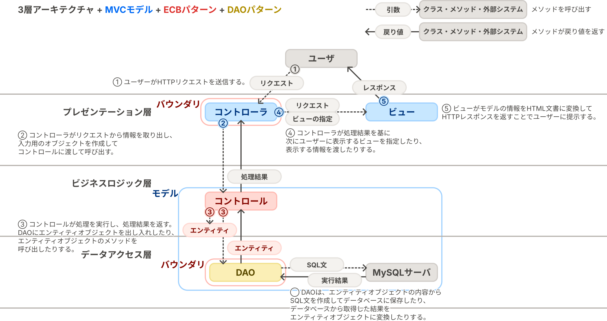

# stuinfo: 学生の情報を登録・取得する機能を持つアプリケーションのサンプル

このテンプレートリポジトリに何も手を付けていない状態であれば、このリポジトリには、学生の情報を登録・取得する機能を持つアプリケーション（stuinfo）のサンプルコードが含まれています。

## アプリケーションの概要

stuinfoは、学生の情報の登録、全件取得、1件取得の3つのユースケースを実装した簡単なWebアプリケーションです。

実装にはプログラム言語Javaを用い、Java Platform, Standard Editionの拡張機能・Jakarta EEで定められている仕様である「[Jakarta Servlet](https://jakartaee.github.io/servlet/)」および「[Jakarta Server Pages (JSP)](https://jakarta.ee/ja/specifications/pages/3.0/)」に沿って実装しています。

## ディレクトリ構成の説明

- `src`
    - `main`
        - `java`：Javaのソースコードを配置するディレクトリです。
        - `resources`：開発するアプリケーションで使用するデータや設定ファイルを配置するディレクトリです。
        - `webapp`：サーブレットコンテナから配信するファイルやJSPを配置するディレクトリです。内部の`WEB-INF`ディレクトリにファイルを配置すると、そのファイルはアプリケーションのユーザからは見えなくなります。セキュリティ上の理由から、JSPファイルは`WEB-INF`ディレクトリに配置することが望ましいとされています。

## サンプルコードのアーキテクチャ

全体を通して、プレゼンテーション層、ビジネスロジック層、データアクセス層の3層からなる**3層アーキテクチャ**を導入しています。
このアーキテクチャはWebアプリケーションの開発で一般的に用いられているものです。

- **プレゼンテーション層**：ユーザとWebアプリケーションの境界であり、ユーザからの入力をビジネスロジック層に渡す前の前処理を行ったり、ビジネスロジック層での処理結果を視覚化してユーザに表示したりする。
- **ビジネスロジック層**：Webアプリケーションで扱う概念やそれらに対する処理をプログラム言語で表現する。
- **データアクセス層**：Webアプリケーションで扱うデータをデータベースに読み書きする。

3層アーキテクチャは、Webアプリケーションが大まかに上記の3層から構成されるものとみなしますが、各層の詳細なアーキテクチャは実装者の判断に委ねられています。

そこで、サンプルコードでは、プレゼンテーション層を整理するために、**MVCモデル**を導入しています。
MVCモデルは、GUIアプリケーションが、画面に表示する概念そのものである **モデル（Model）** 、モデルの内容を画面に表示する仕組みである **ビュー（View）** 、ユーザの操作を処理してモデルを書き換えたり表示するビューを差し替えたりする仕組みである **コントローラ（Controller）** から構成されるとする考え方です。（ECBパターンのコントロールとMVCモデルのコントローラは全く別物なので注意してください）

ビジネスロジック層では、OOSE（オブジェクト指向ソフトウェア工学・後のラショナル統一プロセス）発祥の**ECBパターン**を導入しています。
ECBパターンでは、Webアプリケーションで扱う概念である **エンティティ（Entity）** と、それを操作する **コントロール（Control）** を実装します。
また、ユーザからコントロールを呼び出せるようにするための仕組みや、エンティティオブジェクトをデータベースに読み書きするための仕組みなど、ビジネスロジック層の内外をつなぐ仕組みとして **バウンダリ（Boundary）** を実装します。

データアクセス層では、J2EE（現在のJakarta EE）発祥のデザインパターンである**DAO（Data Access Object）パターン**を導入しています。
DAOパターンは、データベースを、ドメインオブジェクト（ECBパターンのエンティティにあたる）の読み書きを行える**DAO**と呼ばれるクラスに抽象化するもので、ドメインオブジェクトのデータベースへの読み書きを伴う処理は、SQL等を意識することなくDAO経由で行えるようになります。

上記の内容を一つの図にまとめると次のようになります。



## ユースケースおよびステレオタイプごとのクラス一覧

|ユースケース|ビュー（JSP）|コントローラ（サーブレット）|コントロール|操作するエンティティ|DAO|
|--|--|--|--|--|--|
|**すべての学生の情報の取得**|[show-all.jsp](./main/webapp/WEB-INF/students/show-all.jsp)|[ShowAllStudentServlet.java](./main/java/servlet/students/ShowAllStudentServlet.java)|[GetAllStudent.java](./main/java/control/students/GetAllStudent.java)|[Student.java](./main/java/entity/Student.java)|[StudentDao.java](./main/java/dao/StudentDao.java)|
|**指定した学籍番号の学生の情報の1件取得**|[show-one.jsp](./main/webapp/WEB-INF/students/show-one.jsp)|[ShowOneStudentServlet.java](./main/java/servlet/students/ShowOneStudentServlet.java)|[GetOneStudent.java](./main/java/control/students/GetOneStudent.java)|[Student.java](./main/java/entity/Student.java)|[StudentDao.java](./main/java/dao/StudentDao.java)|
|**学生の情報の登録**|なし（「すべての学生の情報の取得」に対応する画面を表示）|[CreateStudentServlet.java](./main/java/servlet/students/CreateStudentServlet.java)|[CreateStudent.java](./main/java/control/students/CreateStudent.java)|[Student.java](./main/java/entity/Student.java)|[StudentDao.java](./main/java/dao/StudentDao.java)|

## プレゼンテーション層とHTTPとサーブレット、JSP

WebアプリケーションはHTTPを応用した技術で、Web上のサーバでアプリケーションを実行して、ブラウザおよびHTTPを通して利用させることで、ユーザにアプリケーションの機能を提供します。
Webアプリケーションのプレゼンテーション層は、ユーザ（厳密にはユーザのブラウザ）からHTTPリクエストを受け付けて、HTTPレスポンスとしてHTML文書を返す層として実装することが一般的です。

HTTPリクエストには次の情報が含まれています。
Webアプリケーションが扱うHTTPリクエストには、リクエストの目的や、呼び出す機能の指定といった情報が含まれています。

- **メソッド**：リクエストの目的（アプリケーションの情報を取得するためのリクエストか、アプリケーションに情報を登録するためのリクエストか、など）を区別する。
- **URL**：呼び出す機能を指定する。
    - URLは次のような文字列である。  
      `https://example.com/path/to/program?param0=value0&param1=value1`
    - **パス**：`/path/to/program`の部分。
    - **クエリパラメータ**：`?param0=value0&param1=value1`の部分。この例の場合、名前が`param0`で値が`value0`のパラメータと、名前が`param1`で値が`value1`のパラメータから成る。
- **HTTPヘッダ**：リクエストそのものについての情報（HTTPボディの形式がどうであるか、など）を持つ。
- **HTTPボディ**：アプリケーションに伝える情報を持つ。リクエストによってはHTTPボディを持たないことがある。
    - HTTPボディに用いられるデータの形式は様々であるが、今回は`application/x-www-form-urlencoded`という、クエリパラメータと同じ形式を用いる。

ブラウザからWebアプリケーションにHTTPリクエストを送信する方法は複数あります。

- HTML文書の`a`要素（いわゆるハイパーリンク）をクリックする。GETメソッドのリクエストのみを送信できる。
- HTML文書の`form`要素（いわゆるフォーム）に情報を入力して送信ボタンをクリックする。GETメソッドとPOSTメソッドのリクエストを送信できる。

サンプルコードでは、これらのHTTPやHTMLの仕組みを利用して、プレゼンテーション層を次のように実装しています。

- ビュー
    - モデルの情報をHTML文書に変換するプログラムとして実装する。
    - JSPとして実装する。
    - 変換後のHTML文書には、MVCモデルのコントローラにHTTPリクエストを送信するための`a`要素や`form`要素が含まれているようにする。
- コントローラ
    - HTTPリクエストを受け取った時に、リクエストのURLに対応したユースケースのプログラムが呼び出されるように実装する。
    - `jakarta.servlet.HttpServlet`のサブクラス（単に「サーブレット」と呼ばれる）として実装する。

これらをビルドしたものをサーブレットコンテナ（サーブレットの仕様に沿って開発されたアプリケーションを実行するための仕組み）に読み込ませて実行すると、Webアプリケーションとして利用させることができます。

## ビジネスロジック層の実装

サンプルコードでは、コントロールおよびエンティティを次のように実装しています。

- コントロール
    - 入力用のオブジェクト（`*Input`型のオブジェクト）を受け取り、出力用のオブジェクト（`*Result`型のオブジェクト）を返すように実装する。
    - アプリケーションに新しい情報を登録するユースケースのコントロールでは、入力用のオブジェクトに基づいてエンティティオブジェクトをインスタンス化して、DAOの登録系メソッドを用いてデータベースにエンティティオブジェクトを挿入する。
    - アプリケーションが持つ情報を取得するユースケースのコントロールでは、DAOの取得系メソッドを用いてデータベースからDAOを通してエンティティオブジェクトを取得する。
- エンティティ
    - コンストラクタおよびセッターメソッドでフィールドに値を代入する前に、代入しようとしている値が不正でないかを確認する。

## DAOの実装

DAOはユースケースから必要とされているメソッドを実装しますが、登録系、取得系、更新系、削除系の4種類のうちのいずれかに当てはまるように実装します。
サンプルコードの[StudentDao](./main/java/dao/StudentDao.java)クラスは、全件取得、1件取得、1件登録に対応するメソッドを実装しています。

各メソッドの処理は概ね次のような手順で進みます。

1. データベース管理システムに入力するSQL文を作成する。
2. SQL文を実行する。取得系のメソッドの場合は`java.sql.ResultSet`型のオブジェクトを得る。
3. 取得系のメソッドの場合は、取得した`ResultSet`型のオブジェクトをエンティティオブジェクトに変換して返す。

また、データベース管理システムと通信するためには、データベース管理システムとの接続を抽象化する`java.sql.Connection`型のオブジェクトが必要です。
これを簡単に得られるように[`DataSourceHolder`](./main/java/dao/DataSourceHolder.java)クラスを用意しています。
このクラスのインスタンスの`dataSource`フィールドから得られるオブジェクトをDAOの`private`フィールドに割り当てておくことで、DAOの各メソッドで`Connection`型のオブジェクトを得る処理を書きやすくなります。

また、データベース管理システムとの通信が終わった際には`Connection.close`メソッドを呼び出して接続を閉じる必要があります。
このエラーハンドリングが煩雑であるため、接続を閉じる処理とそれに伴うエラーハンドリングを抽象化するための[ConnectionCloser](./main/java/dao/ConnectionCloser.java)クラスを用意しています。
このクラスのインスタンスをDAOの`private`フィールドに割り当てておくことで、DAOの各メソッドで接続を閉じる処理を書きやすくなります。

### stuinfoを動作させるのに必要なデータベースおよびテーブルの作成

なお、このサンプルのDAOを動作させるためには、`mysql`コンテナに`database`データベースを作成して、そこに必要なテーブルを作成する必要があります。

まず、[`mysql`コンテナのMySQLサーバに`root`ユーザとしてログイン](../README.md#cliで操作する場合)して、次のSQL文を実行して、データベースを作成します。

```sql
-- データベース`database`を作成する。
create database `database`;

-- `mysql`ユーザーが`database`データベースを操作できるようにする。
grant all privileges on `database`.* to `mysql`@`%`;
```

次に、[`mysql`コンテナのMySQLサーバの`database`データベースに`mysql`ユーザとしてログイン](../README.md#cliで操作する場合)して、[setup/init.sql](../setup/init.sql)に記されているSQL文を実行して、必要なテーブルを作成します。
