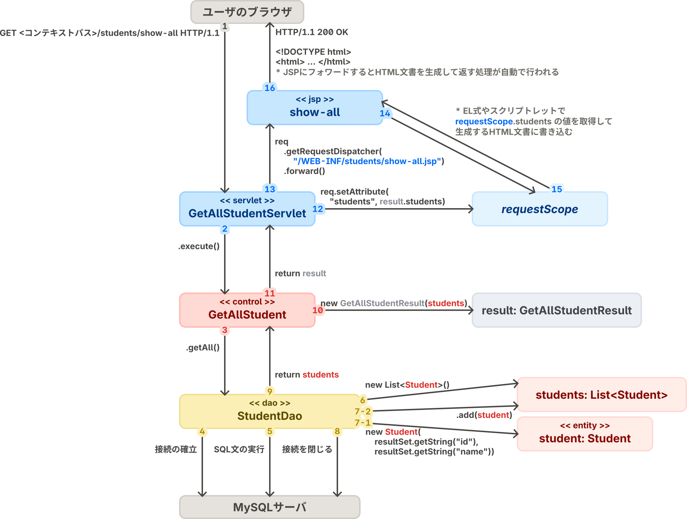

# stuinfo: 学生の情報を登録・取得する機能を持つアプリケーションのサンプル

このテンプレートリポジトリに何も手を付けていない状態であれば、このリポジトリには、学生の情報を登録・取得する機能を持つアプリケーション（stuinfo）のサンプルコードが含まれています。

## 🧭 アプリケーションの概要

stuinfoは、学生の情報の登録、全件取得、1件取得の3つのユースケースを実装した簡単なWebアプリケーションです。

実装にはプログラム言語Javaを用い、Java Platform, Standard Editionの拡張機能・Jakarta EEで定められている仕様である「[Jakarta Servlet](https://jakartaee.github.io/servlet/)」および「[Jakarta Server Pages (JSP)](https://jakarta.ee/ja/specifications/pages/3.0/)」に沿って実装しています。

## 📂 ディレクトリ構成の説明

- `src`
    - `main`
        - `java`：Javaのソースコードを配置するディレクトリです。
        - `resources`：開発するアプリケーションで使用するデータや設定ファイルを配置するディレクトリです。
        - `webapp`：サーブレットコンテナから配信するファイルやJSPを配置するディレクトリです。内部の`WEB-INF`ディレクトリにファイルを配置すると、そのファイルはアプリケーションのユーザからは見えなくなります。セキュリティ上の理由から、JSPファイルは`WEB-INF`ディレクトリに配置することが望ましいとされています。

## 📖 プロローグ：HTTPとWebアプリケーションの話

WebアプリケーションはHTTP（HyperText Transfer Protocol）を応用した技術で、Web上のサーバでアプリケーションを実行して、ブラウザおよびHTTPを通して利用させることで、ユーザにアプリケーションの機能を提供します。

HTTPは元々WWW（World Wide Web）を実装するために開発された技術、つまり「ユーザがブラウザというアプリを用いて、離れた場所のサーバに配置してある文書を取得・閲覧する」という機能を実現するために開発された技術です。
ユーザがサーバ上の文書を閲覧するために、ブラウザのアドレスバーにURLを入力したりHTML文書の`a`要素をクリックしたりすると、ブラウザはHTTPリクエストをWebサーバに送信します。
WebサーバはHTTPリクエストの内容に応じて、HTTPレスポンスを返します。
HTTPレスポンスの中身はHTML文書であることが多いです。

Webアプリケーションは、サーバがHTTPリクエストの内容に応じたプログラムを実行・HTML文書を生成して返すことで、アプリケーションのような動きの実現を試みるものです。
純粋に文書を提供するだけのWebサーバの場合、人が手を加えない限りWebサーバが返すHTML文書の内容が変わることはありません。
しかし、Webアプリケーションの場合、アプリケーションの内部状態に応じてHTML文書を生成して返しています。
そのため、ブラウザにとってはただHTTPでサーバとやり取りを行なっているだけですが、ユーザにとっては、`a`要素や`form`要素で作られたUIを操作すると、自分の操作に応じて画面が変化する（表示されるHTML文書が変わる）のでアプリケーションのように見える、という仕組みです。


📌 HTTPリクエストは、ユーザにとってはWebアプリケーションのサーバに実行してほしいプログラムを指定する情報が含まれているものであり、Webアプリケーションのサーバにとっては自身が実行するプログラムを選択する手がかりとなる情報が含まれているものです。
具体的には次のような情報が含まれています。

- **メソッド**：リクエストの目的（アプリケーションの情報を取得するためのリクエストか、アプリケーションに情報を登録するためのリクエストか、など）を区別する。
- **URL**：呼び出す機能を指定する。
    - URLは次のような文字列である。  
      `https://example.com/path/to/program?param0=value0&param1=value1`
    - **パス**：`/path/to/program`の部分。
    - **クエリパラメータ**：`?param0=value0&param1=value1`の部分。この例の場合、名前が`param0`で値が`value0`のパラメータと、名前が`param1`で値が`value1`のパラメータから成る。
- **HTTPヘッダ**：リクエストそのものについての情報（HTTPボディの形式がどうであるか、など）を持つ。
- **HTTPボディ**：アプリケーションに伝える情報を持つ。リクエストによってはHTTPボディを持たないことがある。
    - HTTPボディに用いられるデータの形式は様々であるが、今回は`application/x-www-form-urlencoded`という、クエリパラメータと同じ形式を用いる。

📌 ブラウザからWebアプリケーションにHTTPリクエストを送信する方法は複数あります。

- アドレスバーにURLを入力する。GETメソッドのリクエストのみを送信できる。
- HTML文書の`a`要素（いわゆるハイパーリンク）をクリックする。GETメソッドのリクエストのみを送信できる。
- HTML文書の`form`要素（いわゆるフォーム）に情報を入力して送信ボタンをクリックする。GETメソッドとPOSTメソッドのリクエストを送信できる。

👉 サンプルコードでは、Webアプリケーションの裏側で何が起こっているのかを簡単にご理解いただくために、[HelloServlet.java](./main/java/servlet/hello/HelloServlet.java)というファイルを用意しました。
[サンプルコードのアプリケーションを起動](../README.md#️-開発したアプリケーションを起動する)して、ブラウザで http://localhost:8080/systemdesign2024/hello-servlet にアクセスしてください。
すると、

1. ブラウザは上記のURLにHTTPリクエストを送信します。
2. HTTPリクエストを受け取ったWebアプリケーションのサーバは、そのURLに紐付けられている `HelloServlet.doGet`メソッドの内容を呼び出します。
3. `HelloServlet.doGet`メソッドには、HTTPレスポンスとしてHTML文書を返すプログラムが書いてありますので、Webアプリケーションのサーバがレスポンスを返し終わったら、ブラウザの画面にはそのHTML文書の内容が表示されるはずです。

このプログラムの内容を、アプリケーションの状態に応じてHTML文書の内容が変化するように書き替えれば、アプリケーションのような挙動を実現できます。
しかし、今回の授業の課題で求められているような複雑なアプリケーションの挙動を1つのファイルのプログラムだけで実現するのは難しいです。
ただHTTPリクエストの内容によってHTML文書の内容が変わるだけならいいかもしれませんが、アプリケーションの情報をデータベースに持たせるとか、データベースへの読み書きを行う必要があるとか、そうなるとどうでしょうか……。

そこで、複雑なアプリケーションを整理して捉えるためのアーキテクチャを導入してみましょう。

## 📌 サンプルコードのアーキテクチャ

サンプルコードでは、全体を通して、プレゼンテーション層、ビジネスロジック層、データアクセス層の3層からなる**3層アーキテクチャ**を導入しています。
このアーキテクチャはWebアプリケーションの開発で一般的に用いられているものです。

- **プレゼンテーション層**：ユーザとWebアプリケーションの境界であり、ユーザからの入力をビジネスロジック層に渡す前の前処理を行ったり、ビジネスロジック層での処理結果を視覚化してユーザに表示したりする。
- **ビジネスロジック層**：Webアプリケーションで扱う概念やそれらに対する処理をプログラム言語で表現する。
- **データアクセス層**：Webアプリケーションで扱うデータをデータベースに読み書きする。

3層アーキテクチャは、Webアプリケーションが大まかに上記の3層から構成されるものとみなしますが、各層の詳細なアーキテクチャは実装者の判断に委ねられています。

そこで、サンプルコードでは、プレゼンテーション層を整理するために、**MVCモデル**を導入しています。
MVCモデルは、GUIアプリケーションが、アプリケーションで扱う概念やそれらに対する処理を表現する **モデル（Model）** 、モデルの内容を画面に表示する仕組みである **ビュー（View）** 、ユーザの操作を処理してモデルを書き換えたり表示するビューを差し替えたりする仕組みである **コントローラ（Controller）** から構成されるとする考え方です。（ECBパターンのコントロールとMVCモデルのコントローラは全く別物なので注意してください）

ビジネスロジック層では、OOSE（オブジェクト指向ソフトウェア工学・後のラショナル統一プロセス）発祥の**ECBパターン**を導入しています。
ECBパターンでは、Webアプリケーションで扱う概念である **エンティティ（Entity）** と、それを操作する **コントロール（Control）** を実装します。
また、ユーザからコントロールを呼び出せるようにするための仕組みや、エンティティオブジェクトをデータベースに読み書きするための仕組みなど、ビジネスロジック層の内外をつなぐ仕組みとして **バウンダリ（Boundary）** を実装します。

データアクセス層では、J2EE（現在のJakarta EE）発祥のデザインパターンである**DAO（Data Access Object）パターン**を導入しています。
DAOパターンは、データベースを、ドメインオブジェクト（ECBパターンのエンティティにあたる）の読み書きを行える**DAO**と呼ばれるクラスに抽象化するもので、ドメインオブジェクトのデータベースへの読み書きを伴う処理は、SQL等を意識することなくDAO経由で行えるようになります。

上記の内容を一つの図にまとめると次のようになります。


## ユースケースおよびステレオタイプごとのソースファイル一覧

サンプルコードでは、上記のアーキテクチャに基づいてプログラムを複数のファイルに分割しています。
次の表では、ユースケースごと・ステレオタイプ（コントロール、エンティティといったクラスの種類）ごとに、そのユースケースに関係するクラスをどのソースファイルに記述しているのかをまとめています。

|ユースケース|ビュー（JSP）|コントローラ（サーブレット）|コントロール|操作するエンティティ|DAO|
|--|--|--|--|--|--|
|**すべての学生の情報の取得**|[show-all.jsp](./main/webapp/WEB-INF/students/show-all.jsp)|[ShowAllStudentServlet.java](./main/java/servlet/students/ShowAllStudentServlet.java)|[GetAllStudent.java](./main/java/control/students/GetAllStudent.java)|[Student.java](./main/java/entity/Student.java)|[StudentDao.java](./main/java/dao/StudentDao.java)|
|**指定した学籍番号の学生の情報の1件取得**|[show-one.jsp](./main/webapp/WEB-INF/students/show-one.jsp)|[ShowOneStudentServlet.java](./main/java/servlet/students/ShowOneStudentServlet.java)|[GetOneStudent.java](./main/java/control/students/GetOneStudent.java)|[Student.java](./main/java/entity/Student.java)|[StudentDao.java](./main/java/dao/StudentDao.java)|
|**学生の情報の登録**|なし（「すべての学生の情報の取得」に対応する画面を表示）|[CreateStudentServlet.java](./main/java/servlet/students/CreateStudentServlet.java)|[CreateStudent.java](./main/java/control/students/CreateStudent.java)|[Student.java](./main/java/entity/Student.java)|[StudentDao.java](./main/java/dao/StudentDao.java)|

## コミュニケーション図

[サンプルコードのアーキテクチャの説明](#-サンプルコードのアーキテクチャ)で示した図をより具体化してコミュニケーション図として表現したものをユースケースごとに作成しました。

### 「すべての学生の情報の取得」ユースケース  


### 「学生の情報の登録」ユースケース  


## プレゼンテーション層とHTTPとサーブレット、JSP

サンプルコードでは、HTTPやHTMLの仕組みを利用して、プレゼンテーション層を次のように実装しています。

- ビュー
    - モデルの情報をHTML文書に変換するプログラムとして実装する。
    - JSPとして実装する。
    - 変換後のHTML文書には、MVCモデルのコントローラにHTTPリクエストを送信するための`a`要素や`form`要素が含まれているようにする。
- コントローラ
    - HTTPリクエストを受け取った時に、リクエストのURLに対応したユースケースのプログラムが呼び出されるように実装する。
    - 処理結果に応じて、モデルの情報をビューに渡したり、モデルの情報をHTML文書に変換するのに用いるJSPを指定したりする。
    - `jakarta.servlet.HttpServlet`のサブクラス（単に「サーブレット」と呼ばれる）として実装する。

これらをビルドしたものをサーブレットコンテナ（サーブレットの仕様に沿って開発されたアプリケーションを実行するための仕組み）に読み込ませて実行すると、Webアプリケーションとして利用させることができます。

### 📌 GETメソッドとPOSTメソッドの使い分けと処理方法

`form`要素からはGETメソッドのリクエストとPOSTメソッドのリクエストの2種類を送信することができますが、`form`要素を書く際にどちらを選べば良いのかとか、各メソッドのリクエストをどのように処理すれば良いのかについて、毎年多くの受講生が頭を悩ませています。
そこで、メソッドの使い分けやそれを踏まえたリクエストの処理方法について記しておきます。

- GETメソッドのリクエスト
    - アプリケーションから情報を取得するだけのユースケースで用いられる。
    - リクエストに対するレスポンスではHTML文書をそのまま返すことが多い。
    - プレゼンテーション層の実装にサーブレットやJSPを用いている場合、HTML文書を返すために、モデルの情報をHTML文書に変換するのに使用するJSPを指定する。このためのプログラムの記述を「**フォワード**」と呼ぶ。
- POSTメソッドのリクエスト
    - アプリケーション上の情報の書き換えを伴うユースケースで用いられる。
    - リクエストに対するレスポンスでは、指定のURLにアクセスするようにブラウザに指示する「**リダイレクト**」を返して、別のURLにGETメソッドを送信させることが望ましい。
        - POSTリクエストに対するレスポンスでHTML文書をそのまま返した場合、ブラウザが再読み込みを行う度にPOSTリクエストが繰り返され、ユーザが意図しないうちにアプリケーション上の情報を書き換える可能性がある。
        - POSTリクエストを処理するプログラムは、アプリケーション上の情報の書き換えを行ったらリダイレクトを返して、処理結果の表示はGETメソッドを処理する別のプログラムに任せるように設計することが多い。

今回はstuinfoのサンプルコードとは別に、これを説明するためだけのサンプルコードを用意しました。

- [HelloGet.java](./main/java/servlet/hello/HelloGet.java)：`<コンテキストパス>/hello-get`に対するGETリクエストを処理するサーブレット。`hello-jsp.jsp`がHTML文書を生成して返すように指定する（**フォワード**）。
- [HelloPost.java](./main/java/servlet/hello/HelloPost.java)：`<コンテキストパス>/hello-post`に対するPOSTリクエストを処理するサーブレット。`<コンテキストパス>/hello-get`にアクセスさせるために**リダイレクト**を返す。
- [HelloPost2.java](./main/java/servlet/hello/HelloPost2.java)：`<コンテキストパス>/hello-post2`に対するPOSTリクエストを処理するサーブレット。`<コンテキストパス>/hello-get`にアクセスさせるために**リダイレクト**を返す。
- [hello.jsp](./main/webapp/WEB-INF/hello/hello.jsp)：JSP。リクエストに含まれるパラメータを表示する。

[サンプルコードのアプリケーションを起動](../README.md#️-開発したアプリケーションを起動する)して、ブラウザでまずは http://localhost:8080/systemdesign2024/hello-get にアクセスしてください。
すると、

1. ブラウザは上記のURLにGETリクエストを送信します。
2. リクエストを受け取ったWebアプリケーションのサーバは、上記URLに対するGETメソッドに対応する`HelloGet.doGet`メソッドを呼び出します。
3. `HelloGet.doGet`メソッドは、レスポンスのHTML文書を`hello.jsp`に生成させるために「フォワード」を行います。
4. `hello.jsp`はHTML文書を生成してレスポンスを返します。
5. ブラウザには`hello.jsp`によって生成されたHTML文書が表示されます。

HTML文書が表示されている画面を操作してみましょう。

- `a`要素によって作られたリンクが3種類あります。それぞれクリックしてみましょう。
    - `<コンテキストパス>/hello-get にアクセスする`
       - 先ほどブラウザのアドレスバーに入力したのと同じURLにアクセスして、同じHTML文書を得たことになるので、画面に変化はみられません。
    - `<コンテキストパス>/hello-post にアクセスする`
        1. ブラウザは、`<コンテキストパス>/hello-post`にGETリクエストを送信します。
        2. Webアプリケーションのサーバは、`HelloPost.doGet`メソッドを呼び出そうとしますが、それは実装されていないため、Webアプリケーションのサーバはエラーを返します。
    - `<コンテキストパス>/hello-get?parameterInGetRequest=You_clicked_the_hyperlink にアクセスする`
        1. ブラウザは、`<コンテキストパス>/hello-post`にGETリクエストを送信します。リクエストの`parameterInGetRequest`パラメータには、`You_clicked_the_hyperlink`という文字列が指定されています。
        2. Webアプリケーションのサーバは、このURLに紐付けられた`HelloGet.doGet`メソッドを呼び出します。
        3. `HelloGet.doGet`メソッドは、レスポンスのHTML文書を`hello.jsp`に生成させるために「フォワード」を行います。
        4. `hello.jsp`は、リクエストに含まれる`parameterInGetRequest`パラメータの値を書き込んだHTML文書を生成して返します。したがって、そこに`You_clicked_the_hyperlink`と書かれたHTML文書が返ってきます。
- `form`要素によって作られたリンクが3種類あります。それぞれ操作して送信してみましょう。
    - `<コンテキストパス>/hello-get にGETリクエストを送信するためのフォーム`
        1. ブラウザは、`<コンテキストパス>/hello-get`にGETリクエストを送信します。リクエストの`parameterInGetRequest`パラメータには、入力した文字列が指定されています。
        2. Webアプリケーションのサーバは、このURLに紐付けられた`HelloGet.doGet`メソッドを呼び出します。
        3. `HelloGet.doGet`メソッドはレスポンスのHTML文書を`hello.jsp`に生成させるために「フォワード」を行います。
        4. `hello.jsp`は、リクエストに含まれる`parameterInGetRequest`パラメータの値を書き込んだHTML文書を生成して返します。したがって、そこに入力した文字列が書かれたHTML文書が返ってきます。
    - `<コンテキストパス>/hello-post にPOSTリクエストを送信するためのフォーム`
        1. ブラウザは、`<コンテキストパス>/hello-post`にPOSTリクエストを送信します。リクエストの`parameterInPostRequest`パラメータには、入力した文字列が指定されています。
        2. Webアプリケーションのサーバは、このURLに紐付けられた`HelloPost.doPost`メソッドを呼び出します。
        3. `HelloPost.doPost`メソッドは、`<コンテキストパス>/hello-get`にアクセスさせるようにリダイレクトを返します。
        4. ブラウザは、返ってきたリダイレクトを踏まえて`<コンテキストパス>/hello-get`にGETリクエストを送信します。
        5. Webアプリケーションのサーバは、このURLに紐付けられた`HelloGet.doGet`メソッドを呼び出します。
        6. `HelloGet.doGet`メソッドは、レスポンスのHTML文書を`hello.jsp`に生成させるために「フォワード」を行います。
        7. `hello.jsp`はHTML文書を生成します。**生成したHTML文書には`parameterInPostRequest`パラメータの値は書き込まれていませんでした**。
            - `parameterInPostRequest`パラメータは、1で送信したPOSTリクエストには含まれていましたが、4で送信したGETリクエストには含まれていません。ブラウザは4のときに、どのパラメータにも値が含まれていないリクエストを送信したことになります。
            - **📌 `doPost`メソッドでリダイレクトする場合で、`doPost`メソッドからリダイレクト先のHTML文書の内容を書き換えたい場合は、**
                - `doPost`メソッドは、アプリケーションの状態によってリダイレクト先のURLのクエリパラメータを変えるように実装する必要があります。
                - リダイレクト先に紐付けられているサーブレットおよびJSPは、クエリパラメータの値によって生成されるHTML文書の内容を変えるように実装する必要があります。
    - `<コンテキストパス>/hello-post2 にPOSTリクエストを送信するためのフォーム`
        1. ブラウザは、`<コンテキストパス>/hello-post2`にPOSTリクエストを送信します。リクエストの`parameterInPostRequest`パラメータの値に入力した文字列が指定されています。
        2. Webアプリケーションのサーバは、このURLに紐付けられた`HelloPost2.doPost`メソッドを呼び出します。
        3. `HelloPost2.doPost`メソッドは、`<コンテキストパス>/hello-get`にアクセスさせるようにリダイレクトを返します。**このとき、`parameterInGetRequest`パラメータに、`parameterInPostRequest`パラメータの値を指定するようにしています**。
            - `HelloPost.doPost`メソッドは、ただ`<コンテキストパス>/hello-get`にアクセスさせるようにリダイレクトを返すだけでした。
            - しかし、`HelloPost2.doPost`メソッドは、リクエストの`parameterInPostRequest`パラメータの値によってリダイレクト先のURLのクエリパラメータの値を変えることで、4で送信するリクエストにパラメータが含まれるようにしています。
        4. ブラウザは、返ってきたリダイレクトを踏まえて`<コンテキストパス>/hello-get`にGETリクエストを送信します。**リクエストの`parameterInGetRequest`パラメータには、1で入力した文字列が指定されています**。
        5. Webアプリケーションのサーバは、このURLに紐付けられた`HelloGet.doGet`メソッドを呼び出します。
        6. `HelloGet.doGet`メソッドは、レスポンスのHTML文書を`hello.jsp`に生成させるために「フォワード」を行います。
        7. `hello.jsp`はHTML文書を生成します。**生成したHTML文書には`parameterInPostRequest`パラメータの値は書き込まれていませんが、`parameterInGetRequest`パラメータの値として1で入力した値が書き込まれていました**。

### 📌 モデルの情報をビューに渡す方法

ビューはモデルの情報をHTML文書に変換しますが、ビューはモデルの情報をどのように取得するのでしょうか？

サーブレットおよびJSPの仕様に従って実装する場合、サーブレット（MVCモデルの「コントローラ」）は、コントロール（ECBパターンの「コントロール」）からモデルの情報を取得し、**「requestオブジェクト」**（サーブレットのメソッドの第1引数のオブジェクトで、`HttpServletRequest`型のオブジェクト）を経由してJSP（ビュー）に渡します。
requestオブジェクトにモデルのオブジェクトを割り当て、requestオブジェクトをJSPに渡して、JSPでrequestオブジェクトからモデルのオブジェクトを取得することで、モデルの情報をビューに渡すことができます。
具体的には次の手順で行います。

1. コントロールが処理結果としてモデルの情報を返すようにすることで、サーブレットがモデルの情報を取得できるようにします。
2. サーブレットは、requestオブジェクトの`setAttribute`メソッドに処理結果として取得したモデルのオブジェクトを渡すことで、requestオブジェクトにモデルのオブジェクトを割り当てます。
    - `setAttribute`メソッドを呼び出す際には、「キー」とそのキーに対応するオブジェクトを渡します。キーを変えることで複数のオブジェクトをrequestオブジェクトに割り当てることができます。
3. サーブレットは、HTML文書をJSPに生成させるためにフォワードします。フォワードする際に、requestオブジェクトがJSPに渡されます。
4. JSPでは、EL式やスクリプトレットを用いることで、サーブレットから渡されたrequestオブジェクトからモデルのオブジェクトを取得することができます。
    - EL式を用いる場合は`requestScope.<キー>`という式で、そのキーに対応するオブジェクトを取得することができます。

## ビジネスロジック層の実装

サンプルコードでは、コントロールおよびエンティティを次のように実装しています。

- コントロール
    - 入力用のオブジェクト（`*Input`型のオブジェクト）を受け取り、出力用のオブジェクト（`*Result`型のオブジェクト）を返すように実装する。
    - アプリケーションに新しい情報を登録するユースケースのコントロールでは、入力用のオブジェクトに基づいてエンティティオブジェクトをインスタンス化して、DAOの登録系メソッドを用いてデータベースにエンティティオブジェクトを挿入する。
    - アプリケーションが持つ情報を取得するユースケースのコントロールでは、DAOの参照系メソッドを用いてデータベースからDAOを通してエンティティオブジェクトを取得する。
- エンティティ
    - コンストラクタおよびセッターメソッドでフィールドに値を代入する前に、代入しようとしている値が不正でないかを確認する。

## DAOの実装

DAOはユースケースから必要とされているメソッドを実装しますが、登録系、参照系、更新系、削除系の4種類のうちのいずれかに当てはまるように実装します。
サンプルコードの[`StudentDao`](./main/java/dao/StudentDao.java)クラスは、全件取得、1件取得、1件登録に対応するメソッドを実装しています。

各メソッドの処理は概ね次のような手順で進みます。

1. データベース管理システムとの接続を確立する。
2. データベース管理システムに入力するSQL文を作成する。
3. SQL文を実行する。参照系のメソッドの場合は`java.sql.ResultSet`型のオブジェクトを得る。
4. 参照系のメソッドの場合は、取得した`ResultSet`型のオブジェクトをエンティティオブジェクトに変換して返す。
5. データベース管理システムとの接続を閉じる。

### データベース管理システムとの「接続」を確立する・閉じる

データベース管理システムと通信するためには、データベース管理システムとの接続を抽象化する`java.sql.Connection`型のオブジェクトが必要です。
これを簡単に得られるように[`DataSourceHolder`](./main/java/dao/DataSourceHolder.java)クラスを用意しています。
このクラスのインスタンスの`dataSource`フィールドから得られるオブジェクトをDAOの`private`フィールドに割り当てておくことで、DAOの各メソッドで`Connection`型のオブジェクトを得る処理を書きやすくなります。

また、データベース管理システムとの通信が終わった際には`Connection.close`メソッドを呼び出して接続を閉じる必要があります。
このエラーハンドリングが煩雑であるため、接続を閉じる処理とそれに伴うエラーハンドリングを抽象化するための[`ConnectionCloser`](./main/java/dao/ConnectionCloser.java)クラスを用意しています。
このクラスのインスタンスをDAOの`private`フィールドに割り当てておくことで、DAOの各メソッドで接続を閉じる処理を書きやすくなります。

> [!WARNING]
> データベース管理システムとの接続は確実に閉じるようにしてください。
> RAM消費量を節約するために、データベース管理システムが受け付けることができる接続の数は24本に限定されています。
> 接続を閉じ忘れて接続数の上限に到達すると、アプリケーションを一度終了するまで新しい接続を確立することができなくなり、アプリケーションが使用不可能になります。

### 👉 stuinfoを動作させるのに必要なデータベースおよびテーブルの作成

なお、このサンプルのDAOを動作させるためには、`mysql`コンテナに`database`データベースを作成して、そこに必要なテーブルを作成する必要があります。

まず、[`mysql`コンテナのMySQLサーバに **`root`ユーザとして** ログイン](../README.md#cliで操作する場合)して、次のSQL文を実行して、データベースを作成します。

```sql
-- データベース`database`を作成する。
create database `database`;

-- `mysql`ユーザーが`database`データベースを操作できるようにする。
grant all privileges on `database`.* to `mysql`@`%`;
```

次に、[`mysql`コンテナのMySQLサーバの`database`データベースに`mysql`ユーザとしてログイン](../README.md#cliで操作する場合)して、[setup/init.sql](../setup/init.sql)に記されているSQL文を実行して、必要なテーブルを作成します。

### 👉 stuinfoからデータベース管理システムへの接続情報の保存場所

データベース管理システムへの接続情報は、`src/main/resources/dataSource.properties`に保存されています。

```properties
jdbcUrl=jdbc:mysql://mysql:3306/database?characterEncoding=utf8&allowPublicKeyRetrieval=true&useSSL=false&serverTimezone=Asia/Tokyo&rewriteBatchedStatements=true
username=mysql
password=password
```

`jdbcUrl`プロパティで、接続先のホスト名、ポート番号、データベース名を設定します。`jdbc:mysql://<ホスト名>:<ポート番号>/<データベース名>`から始まります。

ユーザー名とパスワードはそれぞれ`username`プロパティと`password`プロパティで設定します。
